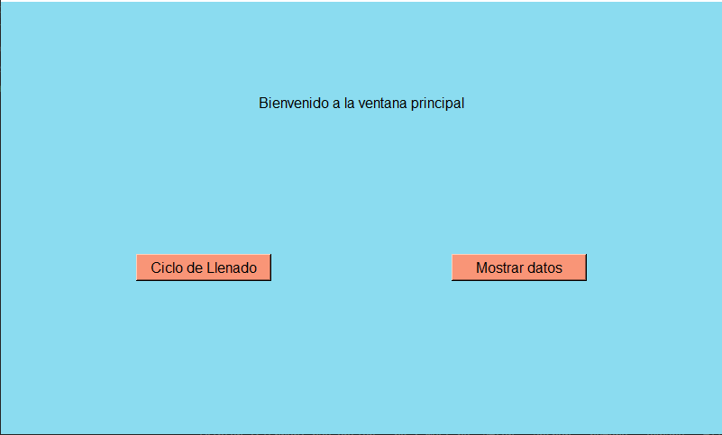

# Python-Tkinter
  
 GUI with python using the tkinter library.
   This project allows the user to enter data, save it in a DB to later display it and perform queries in the DB from the GUI.

  
  
  
  <h3>Note:</h3>
  
The data is entered through the terminal.

